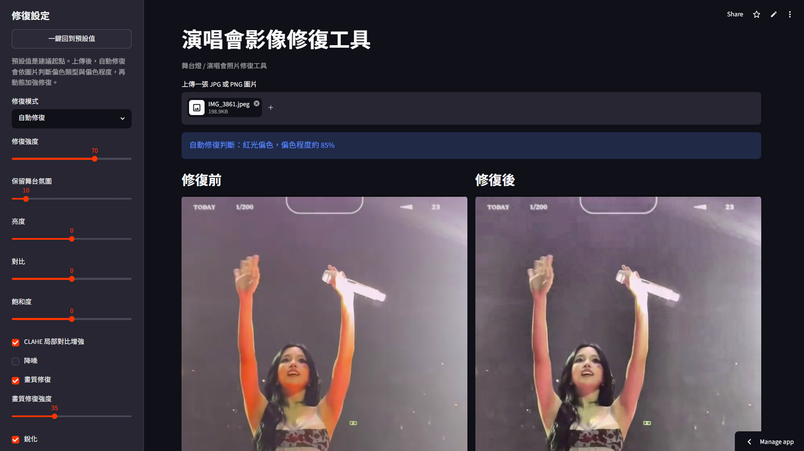
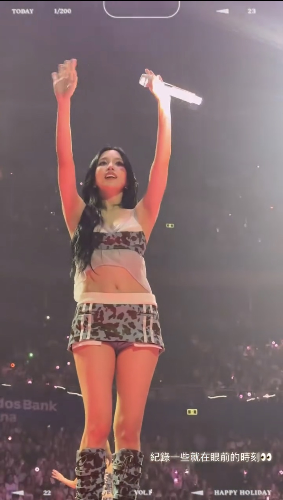
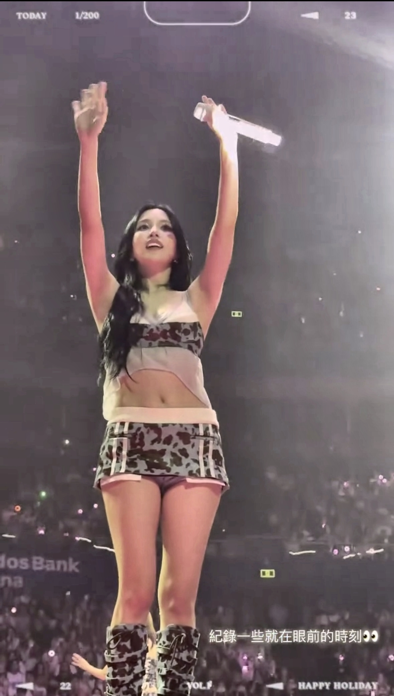
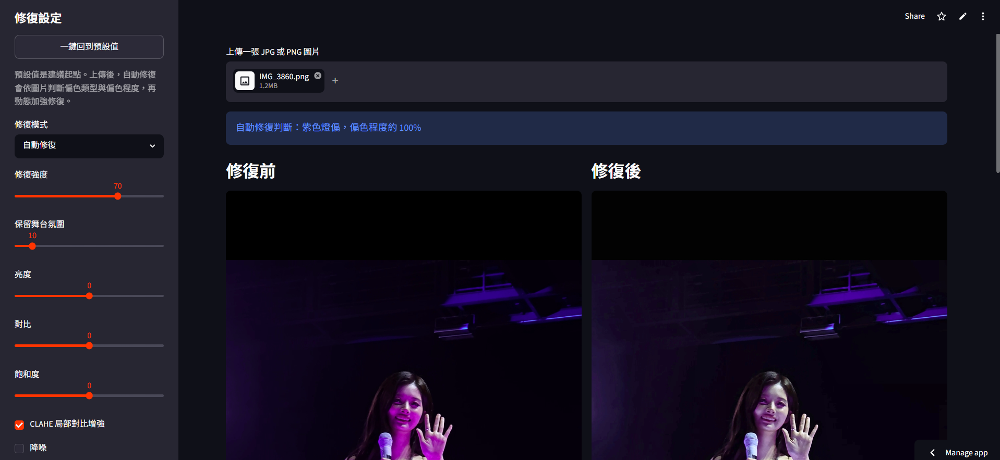
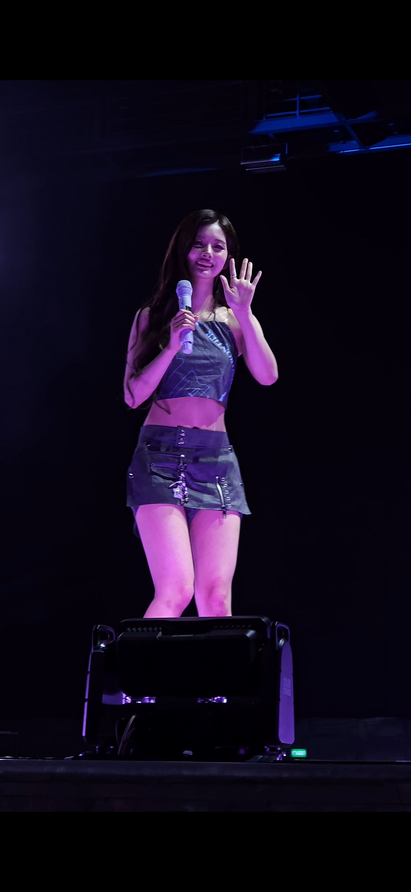
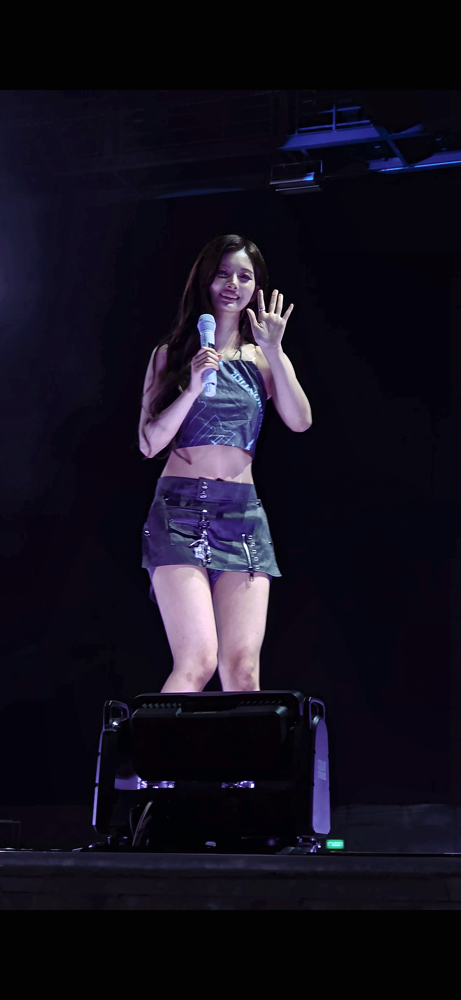

# Stage Light Image Enhancer

## 專案簡介

Stage Light Image Enhancer 是一個使用 Python、FastAPI 和 OpenCV 製作的演唱會 / 舞台燈照片修復工具。這個專案目前支援單張 JPG / PNG 圖片上傳，使用者可以選擇不同的色偏修正模式，調整亮度、對比與飽和度，並套用 CLAHE、降噪與銳化處理，最後下載修復後的圖片。

這是一個作品集專案，重點放在把影像處理流程拆成清楚的模組，透過 REST API 對外提供，並用自訂前端讓非工程使用者也能操作。專案最早的原型是用 Streamlit 做的，`app.py` 仍然保留可以執行。

## 線上 Demo

可以直接開啟 Streamlit 版本試用：

https://stage-light-image-enhancer-9nnjftf4rudasqxdmc8sbq.streamlit.app/

## 專案動機

演唱會或舞台照片常會受到強烈燈光影響，例如紫光、紅光、黃光、低光源、高 ISO 雜訊與對比不足。這些照片雖然有現場感，但有時會讓人物膚色失真、細節變暗，或整張照片偏色嚴重。

我建立這個專案的目標是練習：

- 使用 OpenCV 處理真實影像問題
- 將影像處理邏輯模組化
- 使用 Streamlit 快速建立互動式工具
- 設計一個可以展示在 GitHub 作品集上的完整小型專案

## 功能特色

- 單張 JPG / PNG 圖片上傳，支援拖曳
- Before / After 分割滑桿即時比較
- 支援多種修復模式：Auto、Purple cast、Yellow cast、Red cast、Cyan cast、Low light
- 可調整亮度、對比與飽和度
- 可選擇是否套用 CLAHE 局部對比增強、高光修復、Denoise 降噪、Sharpen 銳化
- 畫質修復：亮度與色彩雜訊分開處理，並依實際雜訊量自動調整強度
- 輸出時可選 2× 超解析度放大
- 顯示目前使用的修復參數
- 下載修復後圖片
- 基本錯誤處理，未上傳圖片時不會報錯

## 使用技術

- Python
- FastAPI / Uvicorn
- HTML / CSS / JavaScript（無框架）
- OpenCV
- NumPy
- Pillow
- Streamlit（早期原型）

## 專案架構

```text
stage-light-image-enhancer/
├── api.py                  # FastAPI 後端（主要入口）
├── app.py                  # Streamlit 版本（早期原型，仍可執行）
├── web/                    # 自訂前端
│   ├── index.html
│   ├── styles.css
│   └── app.js
├── README.md               # 專案說明文件
├── requirements.txt        # Python 套件需求
├── .gitignore
├── models/
│   └── FSRCNN_x2.pb        # 2× 超解析度模型（約 39 KB）
├── src/                    # 影像處理核心，兩個前端共用
│   ├── __init__.py
│   ├── enhancement.py      # 亮度、對比、CLAHE、降噪、銳化、畫質修復
│   ├── color_correction.py # 白平衡與色偏修正
│   ├── pipeline.py         # 整體修復流程
│   ├── superres.py         # 2× 超解析度放大
│   └── utils.py            # 圖片格式轉換工具
├── sample_images/          # 範例圖片，可自行放入測試照片
├── assets/                 # README 圖片或其他素材
└── outputs/                # 輸出圖片暫存資料夾
```

影像處理邏輯全部集中在 `src/`，`api.py` 與 `app.py` 都只負責介面層，不重複實作演算法。

## API 設計

FastAPI 後端把修復流程拆成三個端點。上傳後圖片會存在伺服器記憶體中一段時間，之後調整參數只需要傳參數，不必重新上傳整張圖：

| 方法 | 路徑 | 說明 |
| --- | --- | --- |
| `POST` | `/api/images` | 上傳圖片，回傳 `image_id` 與自動偵測到的偏色類型與程度 |
| `GET` | `/api/images/{id}/original` | 取得縮圖版原圖，作為 before / after 比較的左半邊 |
| `POST` | `/api/images/{id}/preview` | 用縮圖版即時預覽修復結果，調整參數時反應較快 |
| `POST` | `/api/images/{id}/render` | 用原始解析度輸出，供下載使用，可選 2× 放大 |
| `GET` | `/api/capabilities` | 回報這個部署環境實際支援哪些選用功能 |

互動預覽只處理最長邊 1400 px 的縮圖，下載時才跑原始解析度，這樣拉動滑桿時不會每次都等整張大圖運算。

自動產生的 API 文件在 `/api/docs`。

## 安裝方式

建議先建立虛擬環境：

```bash
python -m venv .venv
```

啟用虛擬環境：

Windows PowerShell:

```bash
.venv\Scripts\Activate.ps1
```

macOS / Linux:

```bash
source .venv/bin/activate
```

安裝套件：

```bash
pip install -r requirements.txt
```

## 執行方式

在專案根目錄啟動 FastAPI 伺服器：

```bash
python -m uvicorn api:app --reload --port 8000
```

然後開啟 http://localhost:8000 。上傳一張 JPG 或 PNG 圖片，右側面板調整參數，中間的分割滑桿可以左右拖曳比較修復前後，最後下載原始解析度的結果。

也可以執行早期的 Streamlit 原型：

```bash
streamlit run app.py
```

## 線上使用與部署

這個專案需要一個 Python 服務在背後執行影像處理，不能像純 HTML 一樣直接雙擊檔案開啟。

FastAPI 版本可以部署到 Render、Railway、Fly.io 或 Hugging Face Spaces 等支援長時間執行 Python 服務的平台。啟動指令使用：

```bash
uvicorn api:app --host 0.0.0.0 --port $PORT
```

Streamlit 版本則部署在 Streamlit Community Cloud，Main file path 填 `app.py`：

```text
https://stage-light-image-enhancer-9nnjftf4rudasqxdmc8sbq.streamlit.app/
```

專案已包含：

- `requirements.txt`：部署時安裝必要套件
- `runtime.txt`：指定部署使用的 Python 版本
- `.streamlit/config.toml`：Streamlit 版本的介面設定

## Demo Screenshots

### 紅光偏色自動修復案例

以下案例使用自動修復模式，沒有手動調整參數。App 自動偵測為紅光偏色，偏色程度約 85%，並套用預設修復流程。



| 修復前 | 自動修復後 |
| --- | --- |
|  |  |

### 紫色燈偏自動修復案例

以下案例同樣使用自動修復模式，沒有手動調整參數。App 自動偵測為紫色燈偏，偏色程度約 100%，並套用預設修復流程。



| 修復前 | 自動修復後 |
| --- | --- |
|  |  |

## 方法說明

### White Balance

`gray_world_white_balance` 使用 gray-world assumption 的概念。它假設一張自然影像中 RGB 三個通道的平均值應該接近灰色，當某個通道明顯過強時，就調整各通道比例，降低整體色偏。

在演唱會照片中，這可以用來處理整張照片偏紫、偏紅或偏黃的情況。不過舞台燈本身有強烈風格，所以這裡使用保守的混合強度，避免把現場光感完全消除。

### CLAHE

CLAHE 是 Contrast Limited Adaptive Histogram Equalization。它會針對局部區域提升對比，而不是直接拉整張圖的對比。

這對舞台照片很有幫助，因為人物可能在暗部，背景燈光卻很亮。CLAHE 可以讓暗部細節更明顯，同時用 clip limit 限制過度增強，減少雜訊被放大的問題。

### Highlight Recovery

高光修復會針對過亮區域建立柔和遮罩，將刺眼亮部做保守壓縮，減少白色衣服、麥克風或燈光被過度拉亮的感覺。

這個功能屬於高光保護與亮部壓縮，能避免過曝區域在後續修復中變得更刺眼；但如果原始照片已經完全沒有細節，它無法真正還原已經遺失的紋理。

### 畫質修復

`restore_image_quality` 把亮度與色彩分開處理，因為這兩者劣化的方式不同。

高 ISO 照片最刺眼的是臉上那種紅綠斑塊，也就是色彩雜訊。人眼對細微的色彩變化並不敏感，所以色彩通道可以大膽抹平；亮度通道帶著紋理與細節，只能依實際雜訊量小心清理。

實作上會先用 Immerkaer 法估測雜訊量，再依據結果調整處理強度，讓乾淨的照片在同樣設定下不會被過度處理。亮度降噪使用 non-local means，運算較貴，所以只在偵測到明顯顆粒時才啟用。最後的銳化用 Sobel 梯度做遮罩，只在有結構的地方加強，避免把暗背景的顆粒一起放大。

這個方法能減少雜訊、提升銳利度，但無法還原原本就不存在的細節。

### 超解析度放大

`src/superres.py` 提供 2× 放大，使用 OpenCV `dnn_superres` 模組搭配 FSRCNN 模型（`models/FSRCNN_x2.pb`，約 39 KB）。

幾個設計考量：

- **只在輸出時執行**：互動預覽本來就是縮圖，放大它既慢又看不出差別，所以這個選項只影響下載的檔案。
- **放大放在最後**：先修偏色與降噪再放大，否則會把雜訊和色偏一起放大。
- **分塊處理**：整張手機照片一次送進網路會佔用大量記憶體，所以改成帶重疊的分塊處理，把記憶體用量控制在固定範圍。
- **可降級**：如果安裝的是不含 contrib 的 OpenCV，或模型檔不存在，會自動改用 Lanczos 插值，功能不會壞掉。前端會透過 `/api/capabilities` 顯示實際使用哪一種。

FSRCNN 是輕量模型，畫質提升幅度有限（實測 PSNR 比 Lanczos 高約 0.16 dB），優點是 CPU 就能跑、模型只有幾十 KB，部署負擔很小。

### Brightness / Contrast

亮度與對比調整使用 NumPy 對 RGB array 做像素值轉換：

- Brightness 控制整體明暗
- Contrast 控制像素與中間灰階的距離

這是最基礎但實用的影像修復功能，適合用來快速修正照片過暗、過灰或對比不足的問題。

### Color Cast Correction

專案目前提供紫色、黃色、紅色與藍綠色色偏修正。這些功能會偵測特定通道過強的情況，並以較保守的比例降低偏色通道，同時補回相對不足的通道。

例如：

- Purple cast：降低紅色與藍色相對於綠色的過度優勢
- Yellow cast：降低紅色與綠色相對於藍色的過度優勢
- Red cast：降低紅色通道過強的情況
- Cyan cast：降低綠色與藍色相對於紅色的過度優勢

這些方法不是深度學習模型，而是以 OpenCV 和 NumPy 實作的基礎規則式修正，優點是簡單、快速、容易理解，也適合作為影像處理入門作品。

## 限制與未來改進

目前限制：

- 只支援單張圖片
- 色偏修正是規則式方法，遇到複雜燈光時可能不夠準確
- 沒有做人臉或膚色保護
- 高光修復屬於亮部壓縮與保護，無法還原已完全過曝而遺失的細節
- 畫質修復會依偵測到的雜訊量自動調整，但銳化半徑等參數仍是固定值
- 2× 放大使用輕量模型，能提升銳利度，但無法真的還原不存在的細節
- 尚未加入測試與效能評估

未來改進方向：

- 加入批次處理
- 加入參數 preset 與自訂儲存
- 加入膚色偵測，避免修正後人物膚色不自然
- 加入更進階的曝光保護與高光細節復原
- 加入前後差異圖或直方圖分析
- 加入單元測試與範例圖片
- 支援影片逐幀處理或短影片色彩修正

## 面試時可以說明的重點

這個專案雖然是初學者等級，但可以在面試中說明幾個重點：

- 我把 UI、pipeline、影像增強與色彩修正拆成不同模組，讓程式比較容易維護。
- 我先用 Streamlit 做出可用的原型驗證演算法，確認流程可行後再把介面層換成 FastAPI + 自訂前端，影像處理的核心程式碼完全不需要改動，這正是當初做模組拆分的好處。
- 我設計了 REST API，把即時預覽與最終輸出分成兩個端點：預覽只處理縮圖讓調參數時反應快，下載才跑原始解析度，這是在使用體驗與運算成本之間做取捨。
- 我使用 OpenCV 的 LAB / HSV / RGB 色彩空間，針對不同任務選擇適合的表示方式。
- 我知道規則式影像處理有其限制，所以 README 中有清楚列出目前限制與未來改進方向。
- 我在 pipeline 中設計 mode 與選項參數，讓之後新增新的修復模式或 UI 控制項更容易。
- 我重視使用者體驗，包含 before / after 比較、參數顯示、下載按鈕與基本錯誤處理。

## Requirements

```txt
opencv-python-headless
numpy
Pillow
fastapi
uvicorn[standard]
python-multipart
streamlit
```

## License

This project is currently for learning and portfolio demonstration purposes.
